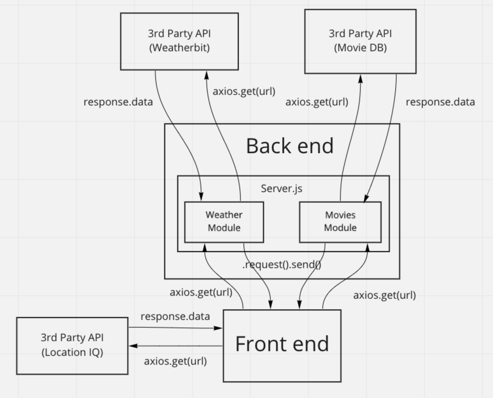
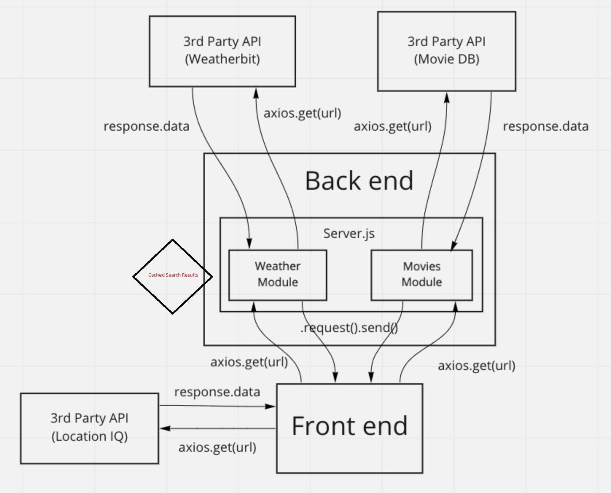

# City Explorer API

**Author**: Daniel Awesome
**Version**: 1.0.6

## Overview

This is a data server for city-explorer providing data package returns for requested information.  Currently it will be used to return weather and movie data requested by the client.

## Getting Started

1. Clone the repository.
2. Create a .env file in the root directory.
3. Add PORT to the .env file and enter the port you wish to use. Use env.sample file as a template.
4. Add WEATHER_API_KEY with an API key to the .env file. Use env.sample file as a template.
5. Add MOVIEDB_API_KEY with an API key to the .env file. Use env.sample file as a template.

## Architecture

- Axios
- npm
- cors
- Heroku.com (for deploying the server)
- jquery

## Change Log

Ver. 1.0.0 08-23-2022 2:55pm - Initial commit.

Ver. 1.0.1 08-23-2022 5:55pm - Added package handling and processing as well has serving requests up to clients based on their querries.

Ver. 1.0.2 08-24-2022 2:43pm - Prep for server handling of API calls and setup of readme file to reflect todays feature implimentation tracking.

Ver. 1.0.3 08-24-2022 6:33pm - Setup server side calls for weather data from weatherbit.io and pushed results to the client.

Ver. 1.0.4 08-24-2022 8:58pm - Handled all server traffic and data processing, both incomming and outgoing.

Ver. 1.0.5 08-25-2022 6:32 - Cleaned up formating and removed any console logs and generally prepared for a final version submission.

Ver. 1.0.6 08-27-2022 2:45 - Changed Async to use Promises instead of a direct async/await method and added search caching.

## Credit and Collaborations

The following are resources used to help create the layout and functionality of this API:

- [The Movie DB Documents](https://developers.themoviedb.org/)

- [WeatherBit Documents](https://www.weatherbit.io/api/weather-forecast-16-day)

- [Async JavaScript with Promises](https://frontend.turing.edu/lessons/module-3/promises.html?ads_cmpid=6451354298&ads_adid=76255849919&ads_matchtype=&ads_network=g&ads_creative=517671727591&utm_term=&ads_targetid=dsa-19959388920&utm_campaign=&utm_source=adwords&utm_medium=ppc&ttv=2&gclid=CjwKCAjwgaeYBhBAEiwAvMgp2rtmulK6nh9cUQAmNkEL6AbAOf9st32iHEG6_CZM-WjEeCgb5AW5-hoCa6cQAvD_BwE)

## Data Flow Chart

### Class 06 Data Flow Chart

### Class 07 Data Flow Chart

### Class 08 Data Flow Chart

### Class 09 Data Flow Chart

### Class 10 Data Flow Chart

## Feature Implimentation Tracking

`Name of feature: Custom Servers with Node and Express`

Estimate of time needed to complete: 10hours

Start time: 3pm

Finish time: 11:30pm

Actual time needed to complete: 8

`Name of feature: API's`

Estimate of time needed to complete: 6 hours

Start time: 2:30pm

Finish time: 9:02pm

Actual time needed to complete: 6.5 hours

`Name of feature: Refactoring into Modules`

Estimate of time needed to complete: 4

Start time: 4:11pm

Finish time: 6:36pm

Actual time needed to complete: 2.5 hours

`Name of feature: Caching Search Results`

Estimate of time needed to complete: 3

Start time: 11:32am

Finish time: 2:50pm

Actual time needed to complete: 3hrs 20mins
