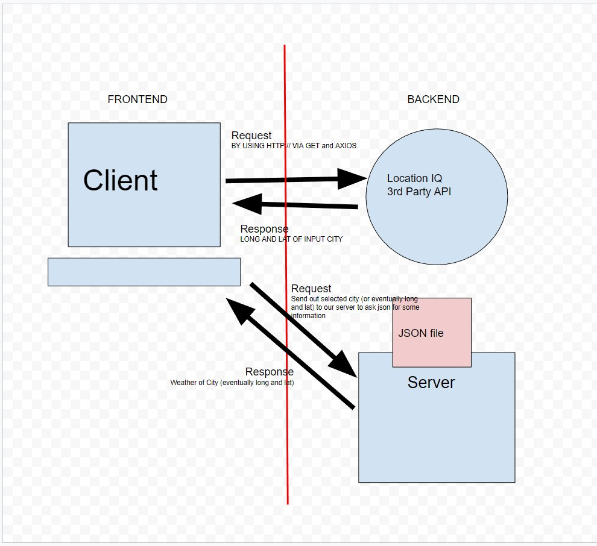
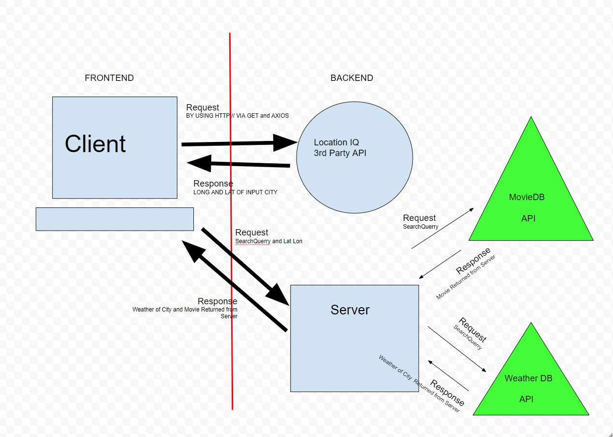

# City Explorer API

**Author**: Daniel Awesome
**Version**: 1.0.0

## Overview

This is a data server for city-explorer providing data package returns for requested information.  Currently it will be used to return weather data requested by the client.

## Getting Started

ADDD KEEEYS HEEREREERERE

## Architecture

- Axios
- npm
- cors middle ware
- Heroku.com (for deploying the server)

## Change Log

Ver. 1.0.0 08-23-2022 2:55pm - Initial commit.

Ver. 1.0.1 08-23-2022 5:55pm - Added package handling and processing as well has serving requests up to clients based on their querries.

Ver. 1.0.2 08-24-2022 2:43pm - Prep for server handling of API calls and setup of readme file to reflect todays feature implimentation tracking

## Data Flow Chart

### Class 06 Data Flow Chart

### Class 07 Data Flow Chart

### Class 08 Data Flow Chart

## Feature Implimentation Tracking

`Name of feature: Custom Servers with Node and Express`

Estimate of time needed to complete: 10hours

Start time: 3pm

Finish time: 11:30pm

Actual time needed to complete: 8

`Name of feature: API's`

Estimate of time needed to complete: 6 hours

Start time: 2:30pm

Finish time: _____

Actual time needed to complete: _____
